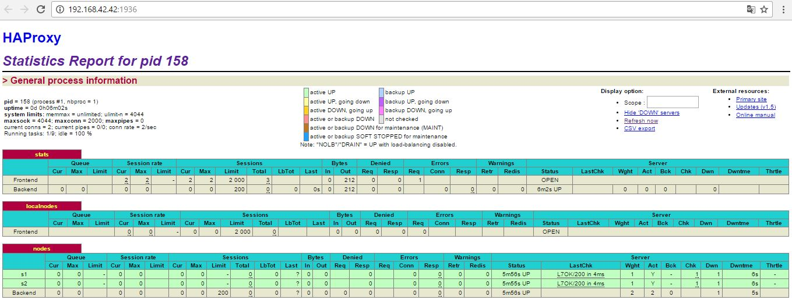

*****************************************************                                                   
* Titre		: AIT- Lab 04 - Docker                                    
* Auteur	: AYOUB Jean & AGHAMAHDI Mohammad Hossein     
* Date   	: 18-12-2016                                
*****************************************************
titre: Lab 04 - Docker
---

##Introduction
- We expect, at least, to see in your report:

  - An introduction describing briefly the lab

  - Seven chapters, one for each task (0 to 6)

  - A table of content

  - A chapter named "Difficulties" where you describe the problems you have encountered and
    the solutions you found

  - A conclusion

##Task 0 : 
Suppose further that there is an obscure bug in the web application
that the developers haven't been able to understand yet. It makes the
web servers crash unpredictably several times per week. When you
detect that a web server has crashed you kill its container and you
launch a new container.

Suppose further currently your web servers and your load balancer are
deployed like in the previous lab. What are the issues with this
architecture? Answer the following questions. The questions are
numbered from `M1` to `M6` to refer to them later in the lab. Please
give in your report the reference of the question you are answering.

1. **[M1]** Do you think we can use the current
   solution for a production environment? What are the main problems
   when deploying it in a production environment? 
    *Nous ne pouvons pas utiliser cette solution. Supposons que nous n'avons pas les moyens financiers pour acheter plusieurs serveurs pour notre application.  Et que nous n’en possédons que 2. Dans ce cas, si le premier serveur tombe en panne, le load-balancer va diriger toutes les requêtes vers le deuxième serveur. Et dans ce cas, il y a une grande charge sur le deuxième serveur. Et le temps de réponse de l’application risque devenir très lent.*

2. **[M2]** Describe what you need to do to add new
   `webapp` container to the infrastructure. Give the exact steps of
   what you have to do without modifiying the way the things are
   done. Hint: You probably have to modify some configuration and
   script files in a Docker image. 
     *En utilisant un script qui va recréer un nouveau fichier de configuration pour le load-balancer lors qu'il reçoit un événement. 
     Et qu’il va redémarrer le load-balancer avec ce nouveau fichier de configuration.* 
     *On se base donc, sur le protocole du multicast. Càd un nouveau serveur s’annonce son existence auprès du réseau, et load-balancer qui se met en écoute.Donc chaque serveur se connecte au load-balancer pour s’annoncer son existence. Et il y a une scripte qui est déclenché et qu'il va régénérer le fichier de configuration de load-balancer.  Et après avoir redémarré le load-balancer, ce dernier aura connu le nouveau serveur. L’avantage est donc, c’est que l’on n’a pas besoin de configurer une adresse ip pour le serveur à l’avance.*  
3. **[M3]** Based on your previous answers, you have detected some issues in the current solution. Now propose a better approach at a high level. 
     *Le problème c'est que si le load balancer crush, comment le nouveau load-balancer sera capable de découvrire les serveurs?
    on installe sur chaque serveur, un outil de diffusion d’information. On considère tous les serveurs possédant cet outil, font partie d’un même cluster. Car ils ont tous installé cet agent. Cet agent a pour but de propager l’information. En se connectant peer-to-peer, les serveurs parlent entre eux, et on se trouve dans une configuration mesh. Càd tout le monde peut parler avec tout le monde, mais ce n’est pas nécessaire que tout le monde avec tout le monde. On peut avoir une configuration qu’un serveur peut parler avec plusieurs serveurs, (un minimum nécessaire) qui connecte tous les nœuds. Et de cette façon, une information est passée à tout le monde. L’avantage c’est qu’il suffit de connencter le load-balancer à un des membres du cluster, l’information est propagée partout sur les autres agents de serveurs. Et dans notre approche, les informations qui vont être diffusées, seront l’existence d’un serveur avec son adresse IP. Maintenant il faut juste faire load-balancer, le membre de ce cluster, comme ça le load balacner connaitra les serveurs avec leurs adresses ip. D'autre part, si on connecte un nouveau serveur à un membre de ce cluster, load-balancer saura aussi qu’il y a un nouveau serveur. Et si le load-balancer lui-même tombe en panne, il suffit juste que l’administrateur système connait une adresse IP qui tourne dans ce cluster, et connecter ce load-balancer au serveur dont il connait son adresse IP, pour que load-balancer connaissent tous les nœuds.* 
4. **[M4]** You probably noticed that the list of web
  application nodes is hardcoded in the load balancer configuration. How can we manage the web app nodes in a more dynamic fashion?
     *Comme expliqué ci-dessus, en créeant un réseau mesh et cluster, tous les noeuds se connaissent et se sont liés ensemble. De cette façon, il suffit de lier un serveur à un cluster, pour que tout le monde prend connaissance de sa présence. et étant donné que le load-balancer fait partie de ce cluster, il saura par la suite son existance avec son adresse ip.* 
5. **[M5]** In the physical or virtual machines of a
   typical infrastructure we tend to have not only one main process
   (like the web server or the load balancer) running, but a few
   additional processes on the side to perform management tasks. 
   For example to monitor the distributed system as a whole it is
   common to collect in one centralized place all the logs produced by
   the different machines. Therefore we need a process running on each
   machine that will forward the logs to the central place. (We could
   also imagine a central tool that reaches out to each machine to
   gather the logs. That's a push vs. pull problem.) It is quite
   common to see a push mechanism used for this kind of task. 
   Do you think our current solution is able to run additional
   management processes beside the main web server / load balancer
   process in a container? If no, what is missing / required to reach
   the goal? If yes, how to proceed to run for example a log
   forwarding process? 
      *En installant sur chaque serveur, un outil de diffusion d’information. Et en faisant un réseau mesh, chaque noeud , grâce à cet outil il transfère l'inormation aux autres.* 

6. **[M6]** In our current solution, although the
   load balancer configuration is changing dynamically, it doesn't
   follow dynamically the configuration of our distributed system when
   web servers are added or removed. If we take a closer look at the
   `run.sh` script, we see two calls to `sed` which will replace two
   lines in the `haproxy.cfg` configuration file just before we start
   `haproxy`. You clearly see that the configuration file has two
   lines and the script will replace these two lines.

    What happens if we add more web server nodes? Do you think it is
   really dynamic? It's far away from being a dynamic
   configuration. Can you propose a solution to solve this?
      *Comme expliqué à la question 3 et à la question 2, en ayant crée un réseau multicast et un réseau mesh, lors qu'un serveur arrive au réseau, annonce sa présence au réseau. Et le load-balancer , étant donné qu'il est lié à ce réseau, va prendre aussi connaissance du nouveau serveur. Et dans ce cas , il y a un script qui va rajouter ce serveur dans le fichier de configuration du load-balancer et va régénérer le fichier de configuration de load-balancer.  Et après avoir redémarré le load-balancer, ce dernier aura connu le nouveau serveur.*

**Deliverables**:

1. Take a screenshot of the stats page of HAProxy at
   <http://192.168.42.42:1936>. You should see your backend nodes.
      

2. Give the URL of your repository URL in the lab report.
	[https://github.com/mohammadhosseinaghamahdi/Teaching-HEIGVD-AIT-2016-Labo-Docker](https://github.com/mohammadhosseinaghamahdi/Teaching-HEIGVD-AIT-2016-Labo-Docker)

##Task 1 :
**Deliverables**:

1. Take a screenshot of the stats page of HAProxy at
   <http://192.168.42.42:1936>. You should see your backend nodes. It
   should be really similar to the screenshot of the previous task.
   	

2. Describe your difficulties for this task and your understanding of
   what is happening during this task. Explain in your own words why
   are we installing a process supervisor. Do not hesitate to do more
   research and to find more articles on that topic to illustrate the
   problem. 
   *Vue que l'on utilise docker, il y a un processus qui tourne à l'intérieur de docker. lors que le processus en foreground s'arête, le contener s'arête aussi.*
   

##Task 2 :
 Nous avons fait la manip de cette partie.  
 

- Give the answer to the question about the existing problem with the current solution :  
	*Le problème c'est qu'un nouveau container doit tout le temps s'enregistrer auprès de ha. Et que normalement , les enregistrements devraient effectué auprès de n'importe quel noeud.* 

- Give an explanation on how Serf is working. Read the official website to get more details about the GOSSIP protocol used in Serf. Try to find other solutions that can be used to solve similar situations where we need some auto-discovery mechanism. 
 Serf utilise un protocole de broadcast pour diffuser des messages vers le cluster. Le protocole de broadcast est basé sur "SWIM: Scalable Weakly-consistent Infection-style Process Group Membership Protocol", avec quelques adaptations mineures, principalement pour augmenter la vitesse de propagation et le taux de convergence.

##Task 3 : 
 - Provide the docker log output for each of the containers: ha, s1 and s2. Put your logs in the logs directory you created in the previous task. 
  c.f. fichiers  ---> logs/task3
##Task 4 : 
##Task 5 : 
##Task 6 : 
##Task 7 : 
##Conclusion
